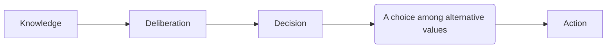

---
{"dg-publish":true,"permalink":"/The Great Issues of Politics/"}
---

> Rather than act blindly, we search blindly, we search for a rationale, a [[Principle\|Principle]] of cause and effect, a set of laws that will make the relationships plain. 

> For our doubts bring indecision and lead to postponement and delay. 

>[!NOTES]+ Quotes
> And thus the native hue of resolution
> Is sicklied o'er with the pale cast of thought,
> And enterprises of great pith and moment 
> With this regard their currents turn awry
> And lose the name of action. 
> \- Source: William Shakespeare, *Hamlet* 

> The mind must analyze before the will decides.

A process flow: 

[[Understanding\|Understanding]]="Reason"+"Intuition"="Empirical Data"+"Feats of Imagination"

On charting course of action and recommendation, cross-reference with [[The hierarchy of consulting\|The hierarchy of consulting]] and [[知行合一\|知行合一]]

X:: On Political Theory and Poltical Action and The Common Sense of Politics